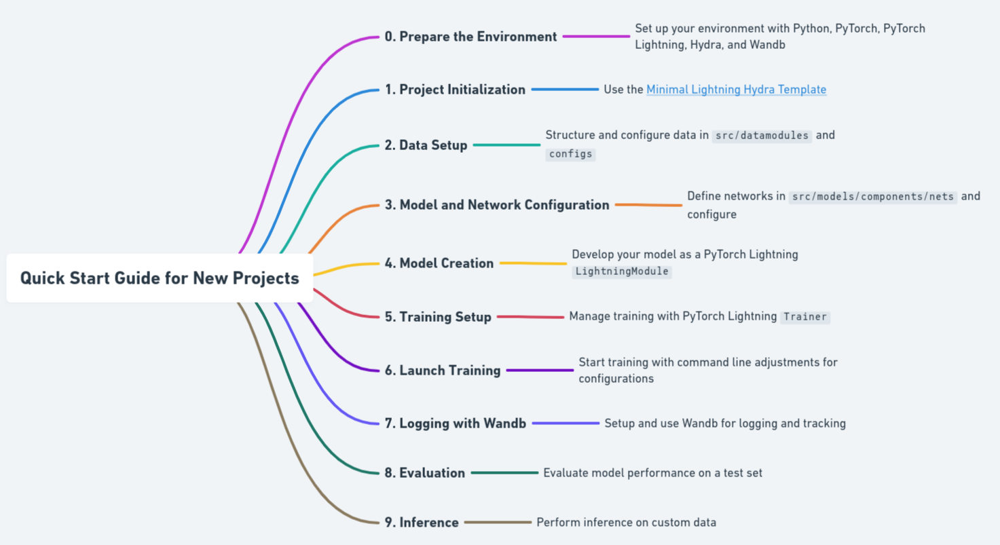

### Quick Start Guide for New Projects



#### **0. Prepare the Environment**
- Set up your environment:
  ```bash
  conda create -n myenv python=3.9
  conda activate myenv
  pip install -r requirements.txt
  ```

#### **1. Project Initialization**
- Use the [Minimal Lightning Hydra Template](https://github.com/antonibigata/minimal-lightning-hydra-template): Click "Use this template" on GitHub, or clone and remove `.git` for a fresh start:
  ```bash
  git clone https://github.com/antonibigata/minimal-lightning-hydra-template.git <project-name>
  cd <project-name>
  rm -rf .git
  ```

#### **2. Data Setup**
- Structure data code in `src/datamodules` and `components/dataset.py`.
- Configure in `configs/datamodule/datamodule.yaml`; use `default.yaml` for shared parameters.
- Example: Adapt FashionMNIST dataset and configurations. Implement and test custom datamodules and datasets.

#### **3. Model and Network Configuration**
- Define networks in `src/models/components/nets` and configure in `configs/model/net`.
- Create simple models for practice, referencing provided examples. Write unit tests to ensure functionality.

#### **4. Model Creation**
- Develop your model in `src/models` as a PyTorch Lightning `LightningModule`.
- Use `configs/model/default.yaml` for base settings; add specific model configs as needed.
- Examine example models and consult [PyTorch Lightning documentation](https://lightning.ai/docs/pytorch/latest/common/lightning_module.html) for guidance.

#### **5. Training Setup**
- Manage training with PyTorch Lightning `Trainer` and configurations in `configs/trainer`.
- Adjust training settings via command line, e.g., `python src/train.py trainer.max_epochs=20`.
- Use `configs/train.yaml` to encompass datamodule, model, callbacks, logger, trainer, and paths settings.

#### **6. Launch Training**
- Start with `python src/train.py`. Override configs as required, e.g., `python src/train.py model/net=conv_net`.
- For GPU training, add `trainer=gpu`.

#### **7. Logging with Wandb**
- Install Wandb, sign up, and authenticate. Modify `configs/train.yaml` for Wandb logging or use `python src/train.py logger=wandb`.
- Log training metrics, images, and explore advanced Wandb features as per [documentation](https://docs.wandb.ai/guides/track/log).

#### **8. Evaluation**
- Evaluate model performance with `python src/eval.py ckpt_path=<path_to_checkpoint>`.
- Use test set for unbiased assessment; locate checkpoints in `logs/train/runs`.

#### **9. Inference**
- Perform inference on custom data: `python src/inference.py ckpt_path=<checkpoint> image_path=<image_path>`.
- Repository includes sample FashionMNIST images in `logs/data_check` for quick tests.
